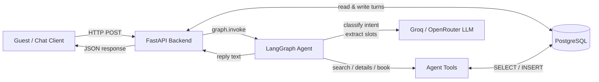

# StayEase Booking Agent

A submission for the **Junior AI Engineer** take-home test. Implements a
focused LangGraph agent that helps guests of *StayEase* — a short-term
accommodation rental platform in Bangladesh — search for available properties,
view listing details, and confirm bookings via a conversational API.

---

## 1. Architecture Document

### 1.1 System Overview

A guest sends a chat message to the **FastAPI** backend. FastAPI loads the
existing conversation from **PostgreSQL** (`conversations`), appends the new
turn, and invokes the compiled **LangGraph** agent. The graph asks a
**Groq / OpenRouter** hosted LLM to classify intent and extract slots, then
calls one of three tools that read from or write to PostgreSQL (`listings`,
`bookings`). The graph composes a friendly reply, FastAPI persists both turns
and the updated agent state, and returns the response to the guest.



### 1.2 Conversation Flow

Walking through one complete example —
*"I need a room in Cox's Bazar for 2 nights for 2 guests"*:

1. **HTTP in.** Guest hits `POST /api/chat/{conversation_id}/message` with the
   text and their phone number. FastAPI loads prior turns from `conversations`
   and restores the persisted agent slots (`listing_id`, `search_criteria`).

2. **Graph entry.** FastAPI calls `graph.invoke(state)` where
   `state.messages` holds the full transcript as LangChain message objects.

3. **`classify_intent` node.** The LLM receives today's date alongside the
   guest message and returns structured JSON:
   `intent="search"`, `search_criteria={location:"Cox's Bazar",
   check_in:"2026-04-28", check_out:"2026-04-30", guests:2}`.
   Relative phrases like "2 nights" are resolved against today.

4. **Conditional edge.** `route_intent` sees `intent="search"` and routes to
   `call_tool`.

5. **`call_tool` node.** Invokes `search_available_properties(location,
   check_in, check_out, guests)`, which runs a correlated subquery against
   `listings LEFT EXCLUDING bookings` to find conflict-free properties.
   Returns up to 10 results with prices in BDT.

6. **`compose_response` node.** The LLM converts the tool JSON into a short
   friendly reply:
   *"I found 5 places in Cox's Bazar for 28–30 Apr — Sea Pearl Beach Suite at
   ৳6,500/night, Sayeman Heritage Studio at ৳4,200/night… Want details on
   any of them?"*
   The `AIMessage` is appended to `state.messages`.

7. **HTTP out.** FastAPI persists both turns and the resolved `listing_id` /
   `search_criteria` to `conversations.agent_state`, then returns the full
   `PostMessageOut` JSON to the guest.

### 1.3 LangGraph State Design

Defined in [agent/state.py](agent/state.py).

| Field             | Type                                                         | Why it is needed                                                 |
| ----------------- | ------------------------------------------------------------ | ---------------------------------------------------------------- |
| `conversation_id` | `str`                                                        | Links every turn back to a row in `conversations`.               |
| `messages`        | `Annotated[list[BaseMessage], add_messages]`                 | Full transcript; `add_messages` reducer appends safely.          |
| `intent`          | `Literal["search","details","book","escalate","unknown"]`    | Drives the conditional edge after `classify_intent`.             |
| `search_criteria` | `SearchCriteria` (TypedDict — location, check_in, check_out, guests) | Extracted slots passed directly to `search_available_properties`. |
| `listing_id`      | `Optional[str]`                                              | UUID of the listing the guest is viewing or booking.             |
| `tool_result`     | `Optional[dict]`                                             | Raw tool output fed into `compose_response`.                     |
| `response`        | `Optional[str]`                                              | Final assistant text returned to the API caller.                 |
| `escalate`        | `bool`                                                       | `True` when the agent cannot help and a human must take over.    |
| `guest_name`      | `Optional[str]`                                              | Guest's name extracted by the LLM — required by `create_booking`. |
| `guest_phone`     | `Optional[str]`                                              | Phone number from the API payload — stored in the booking row.   |

### 1.4 Node Design

Defined in [agent/nodes.py](agent/nodes.py) and wired in
[agent/graph.py](agent/graph.py).

| # | Node                | What it does (1 sentence)                                                                         | Updates state                                              | Next node                                              |
|---|---------------------|---------------------------------------------------------------------------------------------------|------------------------------------------------------------|--------------------------------------------------------|
| 1 | `classify_intent`   | Sends the latest guest turn to the LLM and extracts intent, search slots, and listing reference.  | `intent`, `search_criteria`, `listing_id`, `guest_name`, `escalate` | conditional edge → `call_tool` or `escalate_to_human` |
| 2 | `call_tool`         | Selects and invokes the tool that matches the current intent.                                     | `tool_result`                                              | `compose_response`                                     |
| 3 | `compose_response`  | Asks the LLM to rewrite the raw tool JSON into a short, friendly guest-facing reply in BDT.       | `messages` (appends `AIMessage`), `response`               | `END`                                                  |
| 4 | `escalate_to_human` | Emits a hand-off message and sets `escalate=True` so the API signals a human is needed.           | `messages`, `response`, `escalate`                         | `END`                                                  |

Routing function `route_intent` (conditional edge out of `classify_intent`)
returns `"call_tool"` for `search` / `details` / `book`, and
`"escalate_to_human"` for `escalate` / `unknown`.

### 1.5 Tool Definitions

Defined in [agent/tools.py](agent/tools.py) using the `@tool` decorator with
Pydantic input schemas.

#### `search_available_properties`

| | |
|---|---|
| **Input** | `location: str`, `check_in: date`, `check_out: date`, `guests: int (≥1)` |
| **Output** | `{"results": [{"listing_id": str, "title": str, "price_per_night_bdt": int, "max_guests": int, "rating": float}], "count": int}` |
| **Used when** | Guest provides a city, date range, and guest count and wants to discover available properties. |

Implementation queries `listings` with a correlated `NOT EXISTS` subquery
against `bookings` to exclude any listing with an overlapping confirmed
reservation.

#### `get_listing_details`

| | |
|---|---|
| **Input** | `listing_id: str` (UUID) |
| **Output** | `{"listing_id": str, "title": str, "description": str, "address": str, "price_per_night_bdt": int, "max_guests": int, "amenities": [str], "photos": [str], "rating": float}` |
| **Used when** | Guest asks "tell me more about X" after seeing it in search results. |

#### `create_booking`

| | |
|---|---|
| **Input** | `listing_id: str`, `guest_name: str`, `guest_phone: str`, `check_in: date`, `check_out: date`, `guests: int`, `conversation_id: str?` |
| **Output** | `{"booking_id": str, "status": "confirmed", "total_bdt": int, "check_in": str, "check_out": str}` |
| **Used when** | Guest has explicitly confirmed the listing, price, and dates — agent calls this only after all required fields are known. |

### 1.6 Database Schema

Three tables, kept intentionally minimal.

#### `listings`

| Column                | Type                       | Notes                               |
| --------------------- | -------------------------- | ----------------------------------- |
| `listing_id`          | `UUID PRIMARY KEY`         | Default `gen_random_uuid()`.        |
| `title`               | `TEXT NOT NULL`            |                                     |
| `description`         | `TEXT`                     |                                     |
| `location`            | `TEXT NOT NULL`            | City / area, e.g. `Cox's Bazar`.    |
| `address`             | `TEXT`                     |                                     |
| `price_per_night_bdt` | `INTEGER NOT NULL`         | Whole BDT — no decimals.            |
| `max_guests`          | `SMALLINT NOT NULL`        |                                     |
| `amenities`           | `TEXT[]`                   | e.g. `{wifi,ac,breakfast}`.         |
| `photos`              | `TEXT[]`                   | Public URLs.                        |
| `rating`              | `NUMERIC(2,1)`             | 0.0–5.0.                            |
| `created_at`          | `TIMESTAMPTZ DEFAULT now()`|                                     |

#### `bookings`

| Column            | Type                              | Notes                                          |
| ----------------- | --------------------------------- | ---------------------------------------------- |
| `booking_id`      | `UUID PRIMARY KEY`                | Default `gen_random_uuid()`.                   |
| `listing_id`      | `UUID NOT NULL → listings`        | Foreign key.                                   |
| `conversation_id` | `UUID → conversations`            | Audit link; nullable.                          |
| `guest_name`      | `TEXT NOT NULL`                   |                                                |
| `guest_phone`     | `TEXT NOT NULL`                   | E.164, e.g. `+8801…`.                          |
| `check_in`        | `DATE NOT NULL`                   |                                                |
| `check_out`       | `DATE NOT NULL`                   |                                                |
| `guests`          | `SMALLINT NOT NULL`               |                                                |
| `total_bdt`       | `INTEGER NOT NULL`                | `price_per_night × nights`.                    |
| `status`          | `TEXT NOT NULL DEFAULT 'confirmed'` | `confirmed` or `cancelled`.                  |
| `created_at`      | `TIMESTAMPTZ DEFAULT now()`       |                                                |

#### `conversations`

| Column            | Type                              | Notes                                                     |
| ----------------- | --------------------------------- | --------------------------------------------------------- |
| `conversation_id` | `UUID PRIMARY KEY`                | Default `gen_random_uuid()`.                              |
| `guest_phone`     | `TEXT`                            | Set on first turn if provided.                            |
| `messages`        | `JSONB NOT NULL DEFAULT '[]'`     | Array of `{role, content, created_at}` dicts.             |
| `agent_state`     | `JSONB NOT NULL DEFAULT '{}'`     | Persists `listing_id` and `search_criteria` across turns. |
| `escalated`       | `BOOLEAN NOT NULL DEFAULT false`  | True when handed off to a human.                          |
| `created_at`      | `TIMESTAMPTZ DEFAULT now()`       |                                                           |
| `updated_at`      | `TIMESTAMPTZ DEFAULT now()`       | Updated on every reply.                                   |

---

## 2. Repository Layout

```
.
├── agent/
│   ├── __init__.py
│   ├── config.py    # pydantic-settings — loads .env, exposes typed settings
│   ├── state.py     # AgentState TypedDict + SearchCriteria
│   ├── tools.py     # @tool definitions with Pydantic input schemas
│   ├── nodes.py     # Node functions + routing
│   └── graph.py     # StateGraph construction + compiled singleton
├── app/
│   ├── __init__.py
│   └── main.py      # FastAPI app, lifespan, POST /message, GET /history
├── db/
│   ├── __init__.py
│   ├── models.py    # SQLAlchemy ORM models (Listing, Booking, Conversation)
│   ├── database.py  # Engine, session factory, init_db, seed_db
│   └── seed.py      # 8 sample Bangladeshi listings
├── .env             # Secrets (gitignored)
├── .env.example     # Committed template
├── api.md           # API contract
├── requirements.txt
└── README.md
```

---

## 3. Configuration

All secrets live in `.env` (gitignored). Copy [.env.example](.env.example) and
fill in real values.

| Variable              | Purpose                                                                |
| --------------------- | ---------------------------------------------------------------------- |
| `DATABASE_URL`        | Full SQLAlchemy URL — takes precedence over individual `POSTGRES_*` vars. |
| `POSTGRES_DB`         | Database name (used when `DATABASE_URL` is not set).                   |
| `POSTGRES_USER`       | Database user.                                                         |
| `POSTGRES_PASSWORD`   | Database password.                                                     |
| `POSTGRES_HOST`       | Database host (default `localhost`).                                   |
| `POSTGRES_PORT`       | Database port (default `5432`).                                        |
| `GROQ_API_KEY`        | Groq API key — get one free at console.groq.com.                       |
| `GROQ_MODEL`          | Model name (default `llama-3.3-70b-versatile`).                        |
| `OPENROUTER_API_KEY`  | Optional — swap to OpenRouter instead of Groq.                         |

[agent/config.py](agent/config.py) loads `.env` via `python-dotenv` at import
time and exposes a cached `settings` singleton (`pydantic-settings`). All code
reads `settings.groq_api_key`, `settings.sqlalchemy_url`, etc. — never raw
`os.environ`.

---

## 4. Running

```bash
# 1 — Create the database (once)
psql -U postgres -c "CREATE DATABASE stayease;"

# 2 — Set up virtualenv (use the official Windows Python, not MSYS2)
py -3.12 -m venv myenv
myenv\Scripts\activate          # Windows
# source myenv/bin/activate     # macOS / Linux

# 3 — Install dependencies
pip install -U pip setuptools wheel
pip install -r requirements.txt

# 4 — Configure
copy .env.example .env          # Windows
# cp .env.example .env          # macOS / Linux
# Edit .env: set GROQ_API_KEY and confirm POSTGRES_PASSWORD

# 5 — Start the server
uvicorn app.main:app --reload
```

On first startup `init_db()` creates the three tables (and runs a safe
`ALTER TABLE … ADD COLUMN IF NOT EXISTS` migration for existing databases),
then `seed_db()` inserts 8 sample Bangladeshi listings if the `listings` table
is empty.

API docs: [http://127.0.0.1:8000/docs](http://127.0.0.1:8000/docs)
